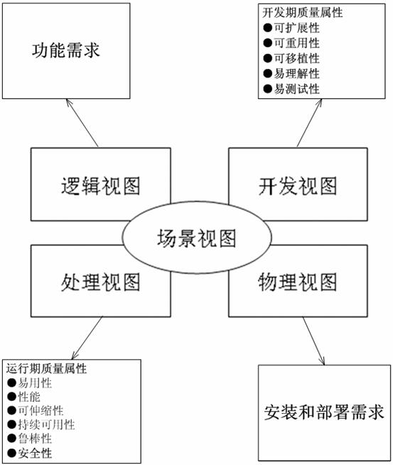

# 架构设计
## 技术架构和系统架构
### 对比
| 维度 | 技术架构 | 系统架构 |
| - | - | - |
| 一句话 | 底层规则 + 通用能力 | 业务场景落地 |
| 核心定位 | 所有系统的技术蓝图，全公司/全产品线的技术底层共识与基础设施 | 面向具体业务系统/行业领域的落地架构方案，是技术架构在业务场景下的实例化 |
| 覆盖范围 | 跨系统、跨业务，强调通用性、一致性、可复用性	| 面向单系统或行业领域，强调业务适配性、场景可行性、性能与可靠性	|
| 建设目标 | 制定 “最小共识规则”，消除技术壁垒，降低研发与运维成本，保障技术生态可持续发展	| 实现业务需求落地，构建可扩展、可维护、符合行业特性的系统方案 |

### 技术架构
| 项 | 内容 | 说明 |
| - | - | - |
| 标准化基座 |通用基础组件库：日志、配置、加密、通信等   基础设施：容器、云原生、监控告警、日志链路等   公共服务：认证授权、消息队列、缓存中间件等 | 为所有系统提供可复用的 “技术积木”，避免重复造轮子，保障底层能力一致性 |
| 技术标准 |接口设计规范：REST/gRPC 协议、版本管理、错误码、幂等性等   数据治理规范：数据模型、存储选型、权限等   服务治理规范：部署策略、扩缩容、熔断限流、灰度发布、监控告警等   编码与安全规范：语言风格、依赖管理、漏洞防护、合规审计等 | 总技术规则：约束所有技术行为，是技术选型、开发、测试、运维的统一依据 |

### 系统架构
| 类型 | 内容 | 说明 |
| - | - | - |
| 单系统专属架构 | 具体业务系统的模块划分、分层设计   接口依赖关系、数据流向   性能与可靠性设计：并发、容错、灾备   部署架构：集群、多活、容灾策略 | 面向单一系统（如某款医疗机器人控制软件），完全贴合该系统的功能、性能与合规需求 |
| 行业通用架构/平台 | 行业领域的通用框架（如医疗机器人设备基础框架）   可复用业务组件：手术流程引擎、设备通信抽象层等   行业合规适配：医疗数据隐私、FDA/CE 认证要求等   插件化/扩展机制：支持不同型号设备快速定制 | 面向某一行业（如医疗机器人），沉淀共性能力，支持多产品 / 多型号快速复用与定制 |

## 系统架构设计
> 软件系统架构是系统的草图，不仅是代码编写而且包括部署，运行、开发等这些方面进行设计，
目的是为了保证软件开发、运行、扩展、性能、安全、伸缩等等质量的一个保证

### 系统架构模型框架
* 是描述系统架构的方法。是一种结构化的方法或标准，用于组织和描述系统或软件的各个方面和视图。
* 提供了一套共享的概念、规则和语义，用于创建、表示和交流系统或软件的模型。
* 模型框架定义了一组规范和约定，以指导模型的创建和使用。它通常包括一些核心概念、模型元素、关系和规则，以及用于表示和描述系统各个方面的视图和视角。

| 架构模型 | 内容 |
| - | - |
| RUP4+1视图模型 | [运用RUP4+1视图方法进行软件架构设计](https://blog.csdn.net/apanious/article/details/51011946), [架构设计4+1视图的作用与关系](https://zhuanlan.zhihu.com/p/112531852) |
| 五视图模型 | [架构设计五视图法](https://www.cnblogs.com/duanxz/p/4526763.html), [软件架构设计-五视图方法论](https://blog.csdn.net/nnsword/article/details/78109126) |
| TOGAF |  |
| C4模型 |  |

### RUP4+1视图模型
* 不同架构视图承载不同的架构设计决策，支持不同的目标和用途：

#### 视图
| 视图 | 英文 | 目标 | uml | 说明 |
| :-: | - | - | - | - |
| 场景视图 | Scenarios View | 系统的使用场景和用户需求 | 用例图 | 系统的功能和行为 |
| 开发视图 | Development View | 开发环境下的静态组织 | 包图、组件图、部署图 | 非业务的通用抽象设计 |
| 逻辑视图 | Logical View | 对象模型 | 包图、类图、组件图 | 系统的组件、类、模块以及它们之间的关系 |
| 进程视图 | Process View | 系统的并发和同步 | 活动图 |  |
| 物理视图 | Physical View | 系统的物理结构和部署环境 | 部署图 | 系统的硬件设备、网络拓扑和物理资源。 |

#### 部署图的区别
| 视图 | 区别 |
| - | - |
| 开发视图 | 抽象设备。如数据存储服务，而不是数据存储服务器 |
| 物理视图 | 真实物理设备。如Web服务器、数据库服务器和数据存储服务器。Web服务器上部署了Web应用程序组件，数据库服务器上部署了数据库组件 |

#### 组件图的区别
| 视图 | 区别 |
| - | - |
| 开发视图 | 非业务组件，如前后端等 |
| 逻辑视图 | 业务组件 |

#### 包图的区别
| 视图 | 区别 |
| - | - |
| 开发视图 | 架构图，如MVC多层架构 |
| 逻辑视图 | 模块图，如用户管理，商品管理 |

### 五视图模型
| 视图 | RUP4+1对比 | 内容 | 目标 |
| :-: | - | - | - |
| 逻辑架构 | 同逻辑视图 | 逻辑元素组成和关系，逻辑元素可以是逻辑层、功能子系统、模块。别名有应用架构和系统架构 | 明确元素及其关系 |
| 技术架构 | 同开发视图 | 分层 | 技术 |
| 运行架构 | 同进程视图 |  | 解决运行中的问题，如并发 |
| 物理架构 | 同物理视图 | 网络、服务器等设施和软件的部署架构 | 高性能、可伸缩性、易维护性，监控 |
| 数据架构 | RUP4+1没有 | 基于数据的设施和软件的部署架构 | 高性能、高可用性、灾备 |

* 没有RUP4+1的场景视图

### TOGAF企业架构
* [TOGAF企业架构](https://zhuanlan.zhihu.com/p/442963069)有4种：业务架构、数据架构、应用架构、技术架构
* [资料](https://segmentfault.com/a/1190000019704801)
* [开放组体系结构框架TOGAF](https://zhuanlan.zhihu.com/p/47939015): 开发企业架构（Enterprise Architecture）的一套方法和工具。企业架构是承接企业业务战略与 IT战略之间的桥梁与标准接口，是企业信息化规划的核心。

## 资料
* [架构](../../arch/arch)
* [软件架构纵横谈1：方法、模式与框架](https://www.cnblogs.com/windfic/p/14998414.html)
* [架构模型](http://www.ruanyifeng.com/blog/2016/09/software-architecture.html)：分层架构，事件驱动架构，微核架构，微服务架构，云架构

### 架构设计分类
>业务架构、应用架构、技术架构、部署架构。
业务架构是战略，应用架构是战术，技术架构是装备。
* [架构分类四种架构方法](https://blog.csdn.net/weixin_43805705/article/details/127967264)