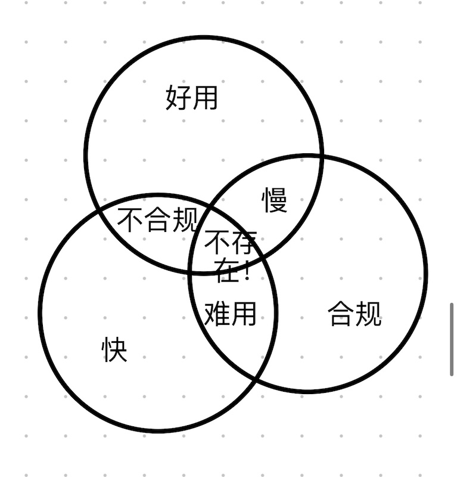
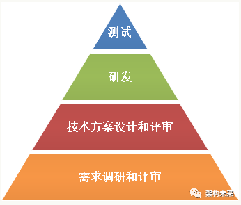

# 研发实践经验
## 重点知识
1. 强监管大系统的研发体系建立条件：QMS，大系统变更的实战经验(不是小系统的)
1. 研发的不可能三角

1. ROI金字塔(ROI从下往上递减)

## 重点事项
### 产品
| 项 | 负责人 | 内容 |
| - | - | - |
| 路线图 | 公司高层 | 规划：型号及其版本，版本及其目标 |
| 用户需求 | 市场产品经理 |  |
| 产品需求 | 研发产品经理 |  |
| 产品设计 | 研发产品经理 |  |
| 系统需求 | 系统工程师 |  |
| 系统设计 | 系统工程师 |  |

### 质量体系
| 项 | 负责人 | 内容 |
| - | - | - |
| 质量体系建设 | 质量工程师 | 含研发体系(如研发流程规范) |

### 架构
| 项 | 负责人 | 内容 |
| - | - | - |
| 技术架构设计 | 系统架构师 |  |
| 行业通用系统架构建设 | 系统架构师 | 框架平台 |

### 研发效能
| 项 | 负责人 | 内容 |
| - | - | - |
| 研发效能平台建设 | 系统架构师 | 流程自动化。如TFS，CICD |
| 研发能力建设 | 团队负责人 |  |

## 大产品小团队
* 定义：复杂产品整体高效集成 + 小团队自主开发
* 解决的问题：既能保留小团队的灵活性和执行力，又能确保跨团队协作和系统集成的顺畅。避免“各自为战”导致的系统碎片化和低效沟通。
* 解决方案的核心思想：解耦与效率。
* 开发的“高效密码”
    1. 技术架构，系统架构：为产品的系统集成提供“技术骨架”和“系统骨架”，减少团队集成的摩擦，各团队可以“自主开发但能顺畅联动”
    1. 跨团队沟通：公司层面增加信息流通效率，让跨团队协作 “直接、透明、聚焦问题解决”。如成立项目组。