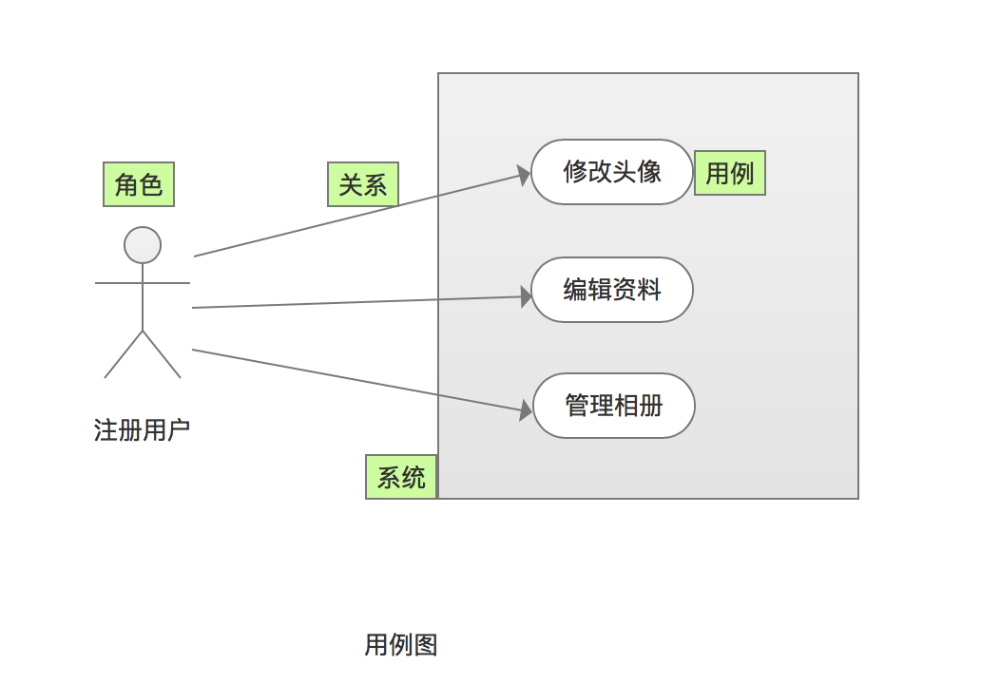
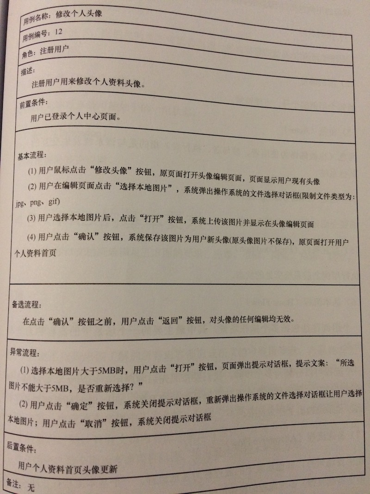

# 产品需求文档
* PRD的关键是**清晰、无歧义**，避免技术细节（如“用Redis缓存购物车数据”），聚焦**用户能看到什么、操作什么、得到什么结果**。
* [PRD到底该怎么写？](http://www.woshipm.com/pmd/192826.html)

## 文档结构
1. 术语，规则，参考文档
1. 产品概述：目标，安全级别，(硬件/软件/开发)环境
1. 产品设计：用户故事、业务规则和流程(流程图、泳道图、时序图)
1. 功能需求
    1. XX模块
        1. 需求用例图
        1. 需求用例(重点或复杂的)
1. 非功能需求
    1. 性能、可靠性，易用性等
1. 原型[可选]

## 需求用例
### 需求用例图
* 图形化表示需求用例的工具。使用图形符号和关系来展示系统中的角色、需求用例以及它们之间的关系。
* 需求用例图可以清晰地展示系统功能的组织结构、用例之间的依赖关系和交互方式，帮助团队更好地理解和分析系统的功能需求。

### 需求用例
* 系统如何与用户（或其他系统）交互的系统行为。结构说明

| 字段 | 必需 | 说明 |
| - | - | - |
| 编号 | Y |  |
| 名称 | Y | 精简说明本用例 |
| 优先级 | N |  |
| 使用角色 | N | 与系统交互的用户或其他系统 |
| 场景描述 | N | 使用场景和背景，描述系统如何与角色交互以实现特定目标的步骤 |
| 前置条件 | Y | 在用例开始之前必须满足的条件 |
| 后置条件 | N | 在用例完成后满足的条件 |
| 业务描述 | Y | 包括数据规则、状态逻辑规则和交互规则。   简单的用文字，复杂的可同时使用原型和UML(状态图，主流程，分支流程，异常流程)   用例不方便写的很细的可以把详细的记录到需求系统(如JIRA、TFS) |

* 需实现功能有本地图片上传和修改头像

## 资料
* [visio设置多个相同类型图形的大小和位置](https://blog.csdn.net/jhsword/article/details/105301529)

### 编写
* [产品经理十四章：产品需求文档(PRD)](https://developer.aliyun.com/article/655300)
* [用原型代替PRD时，原型应该包含哪些内容](http://www.woshipm.com/rp/227461.html)

### Axure RP
1. [Axure RP 7.0快捷键 汇总](http://www.woshipm.com/pd/81482.html)
1. axure库：[axure](http://www.axure.com/community/widget-libraries)，[axureland](http://axureland.com/axure-widget-libraries)