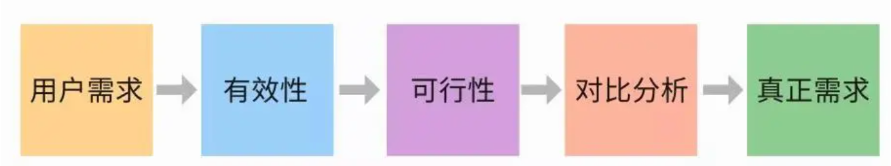

# 需求分析
* [需求分析](https://www.woshipm.com/pmd/587994.html): 从用户提出的需求出发，探究用户内心真正的诉求，提供解决方案，最终转化为产品需求。

* 好的”产品功能”是从”用户需求”转化而来，而不是凭空想出来的。
* 听用户的，但不要照着做
* 不要误解而创造“用户需求”

## 需求调研
* 方法：问卷，访谈，原型
* 来源：客户，竞品，老板

## 需求判断
* 真伪判断：来自目标用户，符合产品定位，技术可实现
* 价值判断：广度，迫切度

* [实例](https://zhuanlan.zhihu.com/p/81957016): 马和汽车，买电钻到缺女朋友(电钻->挂画->没家的感觉->GF)

## 需求评审
1. 业务正确 : 完整，正确
1. 技术可行
1. 可验证
1. 可追溯

## 资料
### 用户故事
* 敏捷开发中用来捕获产品或系统需求的一种方法，它以非技术性的语言描述了用户如何使用某个功能。目的是完善产品需求。
* 从用户的角度来描述用户渴望得到的功能，一个好的用户故事包括三个要素：
    1. 角色：谁要使用这个功能。
    1. 活动：需要完成什么样的功能。
    1. 商业价值：为什么需要这个功能，这个功能带来什么样的价值。
* 用户故事通常按照如下的格式来表达：
    * 英文：As a , I want to , so that .
    * 中文：作为一个<角色>, 我想要<活动>, 以便于<商业价值>
* 一个好的用户故事应该遵循INVEST原则

| 项 | 描述 |
| --- | --- |
| 独立性（Independent） | 要尽可能的让一个用户故事独立于其他的用户故事。用户故事之间的依赖使得制定计划，确定优先级，工作量估算都变得很困难。通常我们可以通过组合用户故事和分解用户故事来减少依赖性。 |
| 可协商性（Negotiable） | 一个用户故事的内容要是可以协商的，用户故事不是合同。一个用户故事卡片上只是对用户故事的一个简短的描述，不包括太多的细节。具体的细节在沟通阶段产出。一个用户故事卡带有了太多的细节，实际上限制了和用户的沟通。 |
| 有价值（Valuable） | 每个故事必须对客户具有价值（无论是用户还是购买方）。一个让用户故事有价值的好方法是让客户来写下它们。一旦一个客户意识到这是一个用户故事并不是一个契约而且可以进行协商的时候，他们将非常乐意写下故事。 |
| 可以估算性（Estimable） | 开发团队需要去估计一个用户故事以便确定优先级，工作量，安排计划。但是让开发者难以估计故事的问题来自：对于领域知识的缺乏（这种情况下需要更多的沟通），或者故事太大了（这时需要把故事切分成小些的）。 |
| 短小（Small） | 一个好的故事在工作量上要尽量短小，最好不要超过10个理想人/天的工作量,至少要确保的是在一个迭代或Sprint中能够完成。用户故事越大，在安排计划，工作量估算等方面的风险就会越大。 |
| 可测试性（Testable） | 一个用户故事要是可以测试的，以便于确认它是可以完成的。如果一个用户故事不能够测试，那么你就无法知道它什么时候可以完成。一个不可测试的用户故事例子：软件应该是易于使用的。 |

### 知识
* 原型和流程图：产品级别讲清楚怎么做怎么用，更好的理解产品需求

### 产品经理
* [好坏产品经理](https://rd.wangyaqi.cn/#/hire/material/pm)
* [产品经理需要具备的6大特质](http://www.yixieshi.com/zhichang/16405.html)
* [产品经理的主要责任——产品价值管理](http://www.heguangming.com/?p=898)
* [产品能力框架图](http://www.yixieshi.com/14532.html)
* [腾讯产品经理校招深圳站面试经验分享（一路面到终面）](http://blog.csdn.net/katherine_he/article/details/37938351)
* [百度产品经理面试案例](http://www.szyc.com/bbs/bwnx-1188-6-2.html)

### 产品设计
* [产品规划七宗罪](http://www.heguangming.com/?p=833)
* [产品经理怎样做好竞品分析](http://www.xker.com/page/e2014/0911/134172.html)
* [MVP](http://36kr.com/p/202916.html)
* [马化腾教你如何做产品：让产品自己召唤人](https://www.axure.com.cn/901/)
* [产品—哲学—张小龙](http://www.geekpark.net/topics/162060)
* [张小龙：APP产品经理必须要懂的30条原则](http://www.yixieshi.com/17656.html)

### 产品编写
* [产品经理十四章：产品需求文档(PRD)](https://developer.aliyun.com/article/655300)
* [用原型代替PRD时，原型应该包含哪些内容](http://www.woshipm.com/rp/227461.html)

### UX原则
| 项 | 说明 |
| --- | --- |
| 易用性 | 方便上网客户浏览和操作，最大限度地减轻后台管理人员的负担，做到部分业务的自动化处理。如批量操作，产品的批量操作无疑是大大节省了操作人员的时间成本。按钮功能的使用需谨慎，并加以不同识别。 |
| 引导性 | 在设计后台界面时，要对用户有一定的引导作用，如在页面空白处给予一定的提示。 |
| 合理性 | 后台设计也不要忘记信息、交互和反馈！合理的功能设计和友好设计对于效率和差错率均会有非常大的提高，小小的设计可能会起到非凡的作用。 |
| 美观性 | 后台设计也需讲究美观！提高卖家的工作效率，吸引更多卖家使用。 |
| 应用性 | 系统设计需切合实际，符合业务流程，简化工作复杂度！很多系统设计时并不能达到完全流水线操作，还是需要人工线下操作，则需判断是否我们的系统设计是否对其线下的工作造成阻碍，最终影响实际工作运营的效率。 |
| 简洁性 | 能在一个页面完成的工作，决不在两个页面实现！其实这涉及到了一个表单的问题，通常我们在前台设计时的原则是让用户填写最少的内容，获得最满意的信息。但在后台设计时恰恰相反，多一步的保存就是对时间的损耗，多一步的页面跳转就是多增加一份差错率的几率。 |

### 工具
1. [Axure RP 7.0快捷键 汇总](http://www.woshipm.com/pd/81482.html)
1. axure库：[axure](http://www.axure.com/community/widget-libraries)，[axureland](http://axureland.com/axure-widget-libraries)
