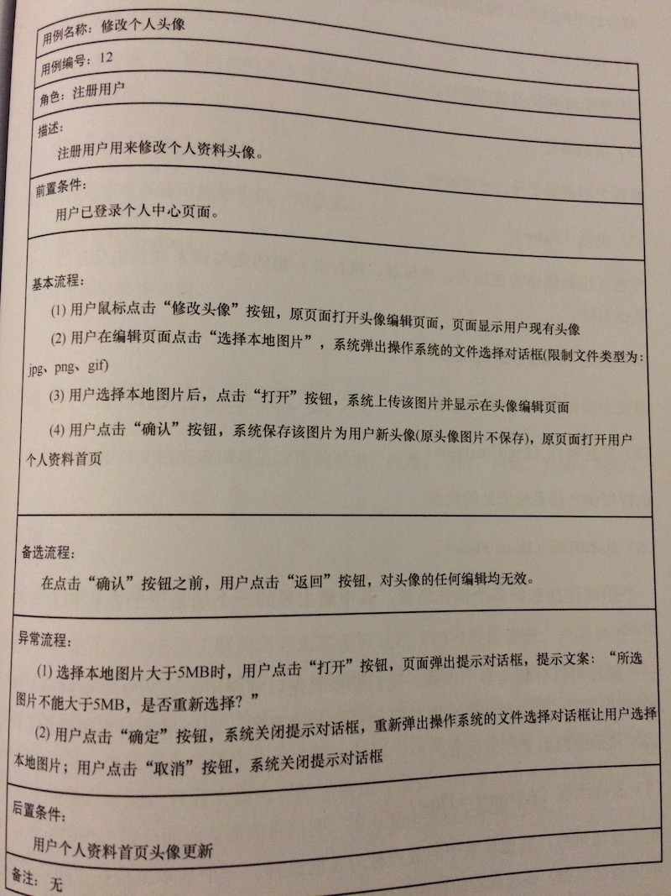

# 系统分析
## 分析方法
* HIPO
    * [HIPO图](https://blog.csdn.net/wangjingna/article/details/41318739) = 层次结构图(H图) + IPO图
    * [层次图和HIPO图---描绘软件结构的图形工具](https://blog.51cto.com/mengdong/1398151)
    * [HIPO图、IPO图、H图的关系](https://blog.csdn.net/lvshihua/article/details/8545345)

## 系统需求类型
1. 功能需求
    * 功能需求里可以有通用模块，如系统管理模块、警告模块
1. 非功能需求

| 项 | 内容 | 说明 |
| - | - | - |
| 接口 | 用户接口(UI), 软件接口(API/对外函数)，硬件接口(通讯/IO) |  |
| 安全 |  |  |
| 质量 |  |  |
| 性能 |  |  |
| 兼容 |  |  |
| 标准法规 | 网络安全等 | 审计日志，版权保护，自动注销(超时自动退出)，数据备份与灾难恢复 |
| 维护 | 审计日志，备份还原等 | 不含功能需求"系统管理" |
| 安装卸载 |  |  |
| 本地化 |  | FDA的特定功能 |

## SRS常用项
### 需求用例图
* 图形化表示需求用例的工具。使用图形符号和关系来展示系统中的角色、需求用例以及它们之间的关系。
* 需求用例图可以清晰地展示系统功能的组织结构、用例之间的依赖关系和交互方式，帮助团队更好地理解和分析系统的功能需求。

### 需求用例(Use Case)
* 系统如何与用户（或其他系统）交互的系统行为。结构说明

| 字段 | 必需 | 说明 |
| - | - | - |
| 编号 | Y |  |
| 名称 | Y | 精简说明本用例 |
| 优先级 | N |  |
| 使用角色 | N | 与系统交互的用户或其他系统 |
| 场景描述 | N | 使用场景和背景，描述系统如何与角色交互以实现特定目标的步骤 |
| 前置条件 | Y | 在用例开始之前必须满足的条件 |
| 后置条件 | N | 在用例完成后满足的条件 |
| 业务描述 | Y | 包括数据规则、状态逻辑规则和交互规则。   简单的用文字，复杂的可同时使用原型和UML(状态图，主流程，分支流程，异常流程)   用例不方便写的很细的可以把详细的记录到需求系统(如JIRA、TFS) |

* 需实现功能有本地图片上传和修改头像

## PRD
* [PRD到底该怎么写？](http://www.woshipm.com/pmd/192826.html)

### 文档结构
1. 术语，规则，参考文档
1. 产品概述：目标，安全级别，(硬件/软件/开发)环境
1. 产品设计：产品的需求用例图，产品的业务流程(流程图、泳道图、时序图)
1. 功能需求
    1. XX模块
        1. 需求用例图
        1. 需求用例
1. XX需求(非功能需求)
    1. XX分类[可选]
        1. 需求用例

## 资料
* [visio设置多个相同类型图形的大小和位置](https://blog.csdn.net/jhsword/article/details/105301529)
